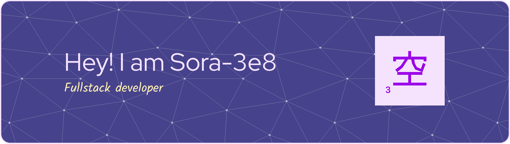

## I'm self taught programmer, physicist and science enthusiast.

I've started with physics and math as it allows us understand and utilize rules which drive our world to hopefully reach the most desirable outcome. 
Computers help us control devices with much more precision and timing thus me getting into coding, was inevitable.

So here I am, world!

# 💻 Tech Stack

## Operating Systems

<!--
**Sora-3e8/Sora-3e8** is a ✨ _special_ ✨ repository because its `README.md` (this file) appears on your GitHub profile.

Here are some ideas to get you started:

- 🔭 I’m currently working on ...
- 🌱 I’m currently learning ...
- 👯 I’m looking to collaborate on ...
- 🤔 I’m looking for help with ...
- 💬 Ask me about ...
- 📫 How to reach me: ...
- 😄 Pronouns: ...
- ⚡ Fun fact: ...
-->
